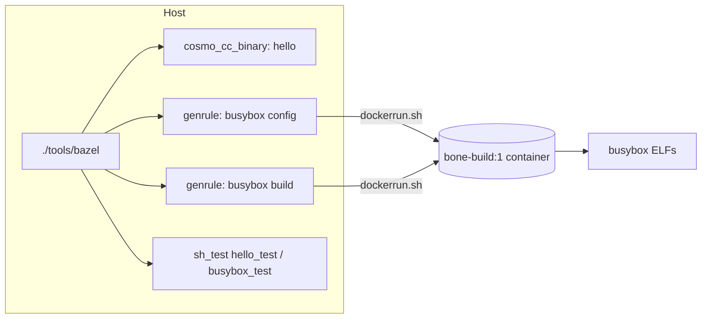

# Tutorial: how the bone build and test work

Audience: a developer who will change the build. Run commands from the repository root.
For the quick command list see `BUILD_README.md`; for decisions see `docs/DESIGN.md`.

## 1. The big picture

Bazel runs on the host. Docker is used inside exactly two genrules.



| Path | Role |
|---|---|
| `MODULE.bazel` | external deps: `@cosmocc` (zip) and `@busybox` (tarball), both sha256-pinned |
| `toolchains/cosmo.bzl` | rule `cosmo_cc_binary`: compiles C with cosmocc |
| `tests/hello/` | `cosmo_cc_binary` plus an `sh_test` |
| `third_party/busybox/` | genrules `config` and `busybox`, which call Docker |
| `tools/dockerrun.sh` | the only place `docker run` is invoked |
| `docker/Dockerfile` | the `bone-build:1` image |
| `tests/busybox/` | `sh_test` on the produced ELFs |

## 2. Hello-world: from `hello.c` to a tested binary

1. **Fetch the compiler.** `MODULE.bazel` declares `@cosmocc` with `http_archive`. Bazel downloads the zip, verifies the
   sha256, and unpacks it to `<output_base>/external/+_repo_rules+cosmocc/`. `toolchains/cosmocc.BUILD` exposes `bin/cosmocc`
   and an `all_files` filegroup.
2. **Declare the target.** `tests/hello/BUILD.bazel`:
   `cosmo_cc_binary(name = "hello", srcs = ["hello.c"])`.
3. **The rule.** `toolchains/cosmo.bzl` calls `ctx.actions.run_shell` with:
   - outputs: `hello` (APE), `hello.x86_64.elf`, `hello.aarch64.elf`
   - inputs: the sources plus the whole cosmocc tree
   - a command that makes `mktemp -d`, sets `HOME` and `TMPDIR` to it, runs `cosmocc -O2 -o <tmp>/hello hello.c`, copies
     the three results to the declared outputs, then deletes the temp directory.

   There is no registered `cc_toolchain`: cosmocc builds both architectures in one call and leaves per-arch files beside the
   output, and a split compile/link toolchain would lose them in the sandbox.
4. **The test.** `sh_test hello_test` runs `check.sh` with the three files as `data`. It checks the ELF machine types
   (`0x3e` x86_64, `0xb7` aarch64) and runs the binary.

## 3. Busybox: from tarball to ELFs

### Step A: config (`//third_party/busybox:config`)

1. The genrule resolves the real path of the busybox tree (`readlink -f`) and copies it to a temp directory.
2. It calls `tools/dockerrun.sh`. In the container `mkconfig.sh` runs `make allnoconfig`, applies `bone.fragment`, runs
   `oldconfig` and strips the timestamp line.
3. The result is `busybox.config`. It is deterministic: two runs give the same sha256.

### Step B: build (`//third_party/busybox:busybox`)

The genrule mounts the busybox source (read-only), cosmocc (read-only), the config, `bone_linux_consts.h` and an output
directory, then runs `build.sh` in the container. For each of `x86_64` and `aarch64`, `build.sh`:

1. copies the source to `/tmp/build-<arch>`
2. runs make with `CC=<arch>-unknown-cosmo-cc`, `LD=<arch>-linux-cosmo-ld`, `AR=<arch>-unknown-cosmo-ar`,
   `STRIP=<arch>-unknown-cosmo-strip`, `HOSTCC=gcc` and `CONFIG_EXTRA_CFLAGS="-include /consts.h"`
3. copies `busybox_unstripped` to `/out/busybox.<arch>.elf`

Then `apelink` fuses the two ELFs into `/out/busybox`. The host genrule copies the three files into Bazel's outputs.

Why it is built this way:
- Busybox partial-links with `$(CC) -nostdlib -r`, which the fat `cosmocc` wrapper rejects, so each arch is built with its
  own cross tools.
- Cosmo resolves signal and socket constants (`SIGUSR1`, `AF_INET6`, ...) at runtime, but busybox needs them at compile time.
  The forced-include header pins the Linux values, so busybox needs no source patch.
- Cosmo's libc has no `linux/*.h`, so the config starts from `allnoconfig` and enables a small applet list.

### Step C: test (`//tests/busybox:busybox_test`)

Checks the ELF header of both files. On Linux x86_64 it also runs `--list`, `echo`, `sort` and `uname -m`.

## 4. Where files live

| What | Where |
|---|---|
| Final outputs | `$(./tools/bazel info bazel-bin)/third_party/busybox/` |
| Output base | `~/.cache/bazel/_bazel_<user>/<hash>/` |
| Downloaded repos | `<output_base>/external/` |
| Action working directory | `<output_base>/execroot/_main/` |
| Test logs | `$(./tools/bazel info bazel-testlogs)/tests/busybox/busybox_test/test.log` |
| Generated action script | `<bazel-bin>/third_party/busybox/busybox.genrule_script.sh` |

Intermediate object files are **not kept**:
- Hello: the `.o` files live in the action's `mktemp` directory, deleted at the end.
- Busybox: the `.o` and `.map` files live in `/tmp/build-<arch>` inside a container started with `--rm`.

So busybox always rebuilds in full, and both genrules are tagged `no-cache` and `local`. To keep the objects while debugging,
copy `/tmp/build-*` to `/out` in `build.sh`.

## 5. What `k8-fastbuild` means

`bazel-out/k8-fastbuild/` is Bazel's configuration directory, named `<CPU>-<compilation_mode>`.
- `k8` is the host CPU (x86_64 Linux). The old macOS tree was `darwin_arm64-fastbuild`.
- `fastbuild` is the default `--compilation_mode`.

It only decides where Bazel puts outputs (`bin/`, `testlogs/`). Compile flags come from `copts = ["-O2"]` in `cosmo.bzl` and
from the busybox config, so `-c opt` does not change the cosmocc or busybox builds.

## 6. Where Docker is used

Only `//third_party/busybox:config` and `//third_party/busybox:busybox`, through `tools/dockerrun.sh`:

```
docker run --rm -u <uid>:<gid> -e HOME=/tmp -e TMPDIR=/tmp -v ... bone-build:1 <cmd>
```

- Running as the host UID keeps output files from being owned by root.
- The genrules are `local` (no sandbox) because they call the host Docker daemon with host paths.
- The image is not a Bazel input. After editing `docker/Dockerfile`, rebuild the image and force the genrules to re-run.
- Hello, and both `sh_test` targets, run directly on the host.

## 7. Watching the build live

Bazel level:
```
./tools/bazel build //third_party/busybox:busybox -s              # print every command
./tools/bazel build //third_party/busybox:busybox --verbose_failures --sandbox_debug
./tools/bazel test //tests/hello:hello_test --test_output=streamed
tail -f $(./tools/bazel info command_log)                         # second terminal
```

Inside the container, `build.sh` writes make output to `/tmp/build-<arch>.log` inside the container. Bazel prints its tail
only on failure. To follow it live, from a second terminal during the build:
```
docker ps                                       # find the container id
docker exec <id> tail -f /tmp/build-x86_64.log  # later: /tmp/build-aarch64.log
```

Inspect exactly what runs:
```
./tools/bazel aquery //third_party/busybox:busybox
cat $(./tools/bazel info bazel-bin)/third_party/busybox/busybox.genrule_script.sh
```

## 8. Common changes

| Goal | Change |
|---|---|
| Add an applet | add `CONFIG_<NAME>=y` to `third_party/busybox/bone.fragment`, rebuild, check `--list`; if it fails to compile, remove it |
| Add a Linux constant that cosmo resolves at runtime | add it to `third_party/busybox/bone_linux_consts.h` |
| Add a build tool to the image | edit `docker/Dockerfile`, then `docker build -t bone-build:1 docker/` |
| Change the compiler flags for C code | `copts` in `toolchains/cosmo.bzl` (hello), `CONFIG_EXTRA_CFLAGS` in `build.sh` (busybox) |

## 9. Known limits

- The fused `busybox.com` needs the APE loader, which fails on this host and in the container. Use the per-arch ELFs.
- The aarch64 ELF is only header-checked. Running it is planned for the QEMU milestone (M9).
- Busybox has no incremental compile (see section 4).
